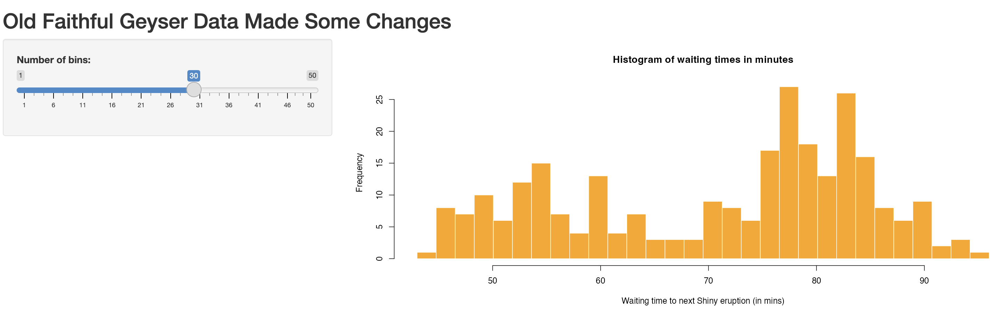
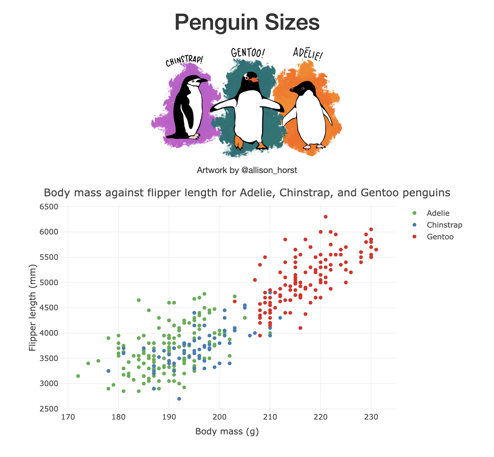

# Challenge exercises from Shiny Intro class

Exercies from the Introductory R Shiny Masterclass by [Epi-interactive](https://www.epi-interactive.com/).

## Session 1:  Small demo

## Session 3: Reactivity

## Session 5: Using Shiny with Plotly

## Session 6: Using Shiny with Leaflet

